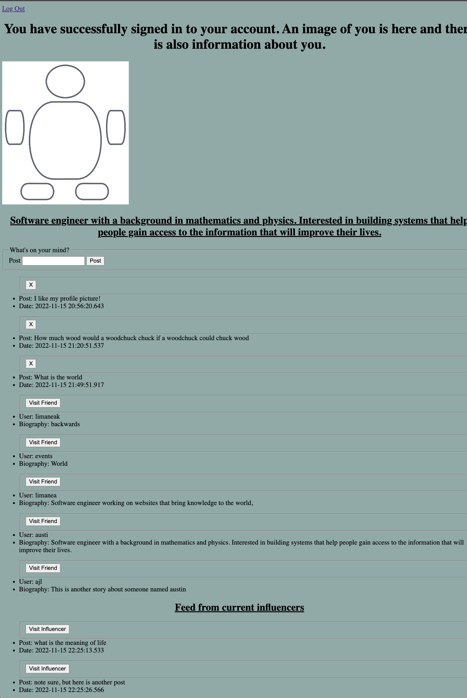
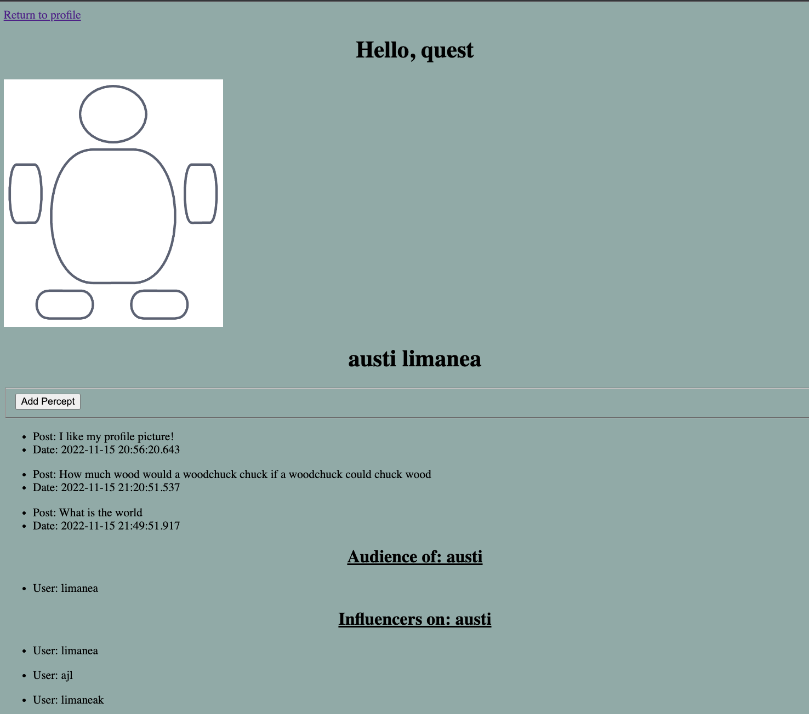

# Secure code fellowship

## Expanded Features with v-2.1

User now have the ability to follow other users (influencers). Someone who follows an influencer is part of an audience of that influencer. When you visit a influencer page you can see their audience and their influencers. In addition, when you visit your homepage you can access a feed that shows all the posts from all of your influencers. You can easily access one of your influencers by clicking the `visit influencer` button on the post.

To add more influencers, just navigate to a users page a click the `add percept` button. 

All of the previous features from earlier versions are still active.

## Expanded Features with v-2.0

Users can make posts to their own profile. In addition, they can see all of their friends on their profile page. A user can visit another user's page, but they are not able to edit their friend's posts. Each user has a default image that is pulled from a html fragment. Furthermore, on the user profile, the user can see their biography that they edited when they sign up for the application.

## Features v-1.0

This application allows for user to sign up for an account using the Spring security framework. Users input information about their username, password, first name, last name, biography, and their date of birth. This information is stored into a database. The user will be directed to a webpage with basic styling and an ability to sign out.

## Running 

Use `./gradlew bootRun` to run the application. The user will need to modify the `codefellowship/src/main/resources/application.properties` file in order for the application to run properly. The application requires being wired up to a database.

    spring.datasource.url=jdbc:postgresql://localhost:5432/codefellowship
    spring.datasource.username=postgres
    spring.datasource.password=
    spring.jpa.hibernate.dll-auto=update
    spring.jpa.generate-ddl=true

The password must be up input appropriately to your system.

